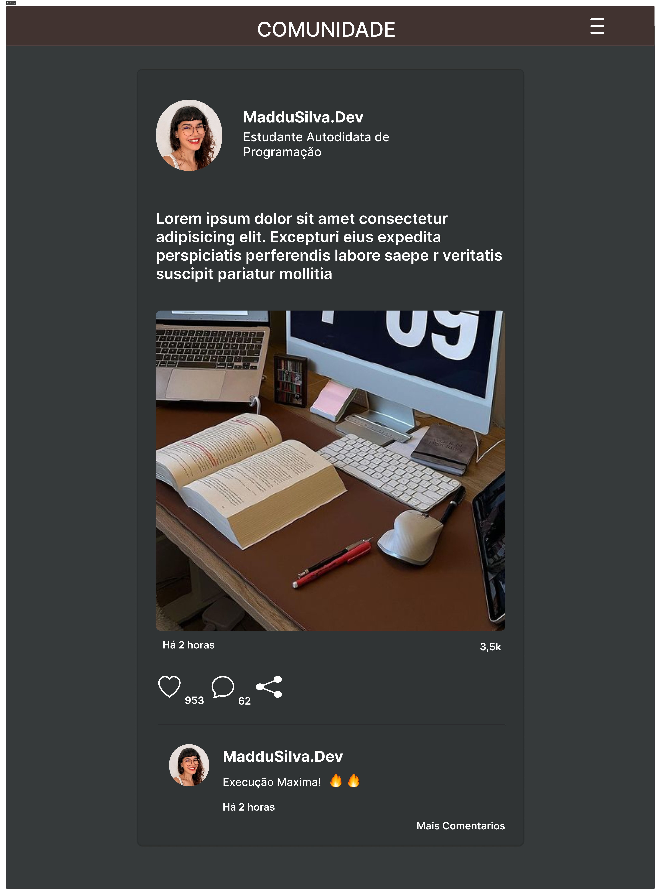

<h1 align="center" id="project_name">
   
  Biblioteca Digital
   
  
   
</h1>

Esse é um projeto pessoal que ainda está em desenvolvimento

<h2 id="about">
💻 Sobre o projeto
</h2>
Um dos meus mais recentes projetos que ainda está em fase de desenvolvimento. 
 
Sempre tive muita paixão pela leitura, mas venho de uma familia baixa renda e não tive muito contato com livros alem do ambiente escolar. Desde que descobri a existência de sebos de livros, que são aqueles ambientes de compra e venda de livros usados, me mantenho em busca materiais gratuitos, mais baratos, alguns até danificados. 
Não me envergonho de dizer que até sites piratas para baixar pdf de livros ja usei. 
 
Com isso, quando iniciei no IFBA (Instituto Federal de Educação Ciência e Tecnologia da Bahia), meu primeiro projeto na disciplina de Banco de Dados foi um modelo relacional de como funcionaria uma Biblioteca digital. Hoje, depois de mais de um ano desse projeto, me veio essa ideia e simplesmente coloquei a mao na massa no figma. 
 
Como disse anteriormente, ainda é um projeto em desenvolvimento, então aqui está o protótipo de um site onde é possivel acessar livros em pdf de forma gratuita, implementado a uma comunidade de leitores e estudantes no estilo Twitter, porém para conectar essas pessoas e para que elas possam criar laços entre si.
 
Mas esse ainda é o primeiro protótipo, estou buscando muitas questões que preciso desenvolver.

  

  

  
  
  

  

  

 
<h2 id="technologies">🛠 Tecnologias</h2>

As seguintes ferramentas foram usadas na construção do projeto:

- **[Figma](https://exemplo.com)**

**Utilitários**

- Protótipo: **Figma** → **[Biblioteca-ByMaddu](https://www.figma.com/file/bTJy6j7DeNIEmDV0ujWAUu/Untitled?type=design&t=Dsfq7flNkhZ7sELM-6)**

<h2 id="author">🦸 Autor</h2>
<a href="#">

 <b> Maria Eduarda da Silva </b></a>

 <h2 id="author">Social</h2>
<a href="#">

 

 

*Made with love ♡ by Maddu* 👋🏽 [Entre em contato!](https://www.linkedin.com/in/maddusilvadev/)

